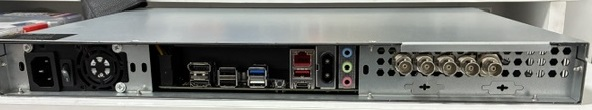
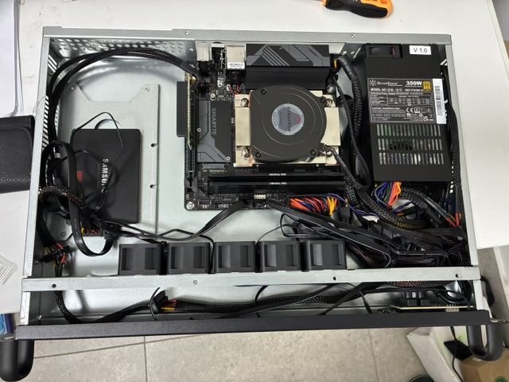
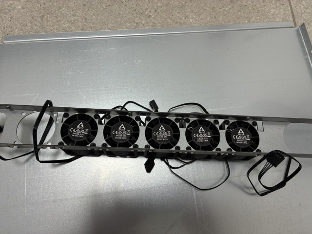

# NxFrame

NxFrame is a Linux-based broadcast contribution encoder/decoder for low-latency SDI-over-IP workflows.

It captures SDI video/audio from Blackmagic DeckLink cards, encodes the signal, muxes it into MPEG-TS, sends it over IP using SRT, UDP, or RTP, and can receive/decode the stream back to SDI output.

NxFrame is designed for broadcast engineering, contribution links, lab testing, and controlled evaluation of SDI-over-IP workflows.

## What NxFrame does

- Captures SDI input from Blackmagic DeckLink cards
- Normalizes DeckLink v210 input to an internal 10-bit 4:2:2 video format using a custom SIMD/AVX2 conversion path 
- Encodes video using libx264 up to 10-bit 4:2:2 1080p50/60
- Keeps FFmpeg/libx265 support for experimental HEVC testing
- Encodes audio using FFmpeg/libfdk-aac, or carries PCM/S302M audio including Dolby-E passthrough, with audio carried either in separate PIDs or packed together
- Muxes audio/video into MPEG-TS
- Sends MPEG-TS over:
  - SRT
  - raw UDP
  - RTP payload type 33
- Receives SRT/UDP/RTP transport streams
- Demuxes and decodes received streams
- Outputs decoded video/audio to DeckLink SDI output
- Provides CLI example presets, protected GUI templates, and generated per-channel sender/receiver configurations
- Provides optional CPU profile handling for controlled real-time encoding

## Reference 1U build

NxFrame has been tested in a compact 1U SDI contribution encoder build. This is not required hardware, but it documents one validated direction for a small, high-performance, low-power, low-noise broadcast appliance.

Tested 1U build:

- 1U mini-ITX chassis
- AMD Ryzen 7 9700X, using Eco mode and BIOS power limits around 65-75 W
- Mini-ITX AM5 motherboard
- 32 GB DDR5 memory
- SATA SSD (less heat than NVMe)
- Blackmagic DeckLink Duo 2 via PCIe riser
- Dynatron A45 1U AM5 CPU cooler
- 5 x 40 mm chassis fans fixed at 4,200 RPM to push enough air through the case without becoming loud
- 350 W Flex ATX power supply

The main idea of this build is not maximum CPU boost. The goal is stable real-time x264 contribution encoding inside a very small chassis by controlling power, temperature, and fan noise.

For a single real-time x264 contribution stream, the CPU profile can cap the Ryzen 7 9700X around 4.0 GHz. In testing, this kept CPU package power around 40-45 W while maintaining real-time encoding. Leaving the CPU fully automatic can allow boosts around 5.4-5.5 GHz, which may raise package power to around 75 W and make 1U cooling significantly louder.

In one 2-hour 1080i50 10-bit 4:2:2 encode test, with room ambient temperature around 30°C, CPU temperature remained stable around 65°C, CPU package power was around 45 W, and the fans remained relatively quiet.

This makes the CPU profile useful for appliance-style deployments where predictable thermals and acoustics are more important than maximum benchmark performance.





## Project status

NxFrame is currently in active testing and controlled field-evaluation stage.

The project has moved beyond basic lab proof-of-concept testing and is now being validated with real DeckLink SDI hardware, real-time x264 contribution presets, SRT/UDP/RTP transport, receiver workflows, audio routing, CPU power profiles, and compact 1U hardware testing.

NxFrame is suitable for development, lab testing, controlled field tests, and engineering evaluation. It should not yet be treated as a fully certified production appliance.

The main validated real-time path is x264-based contribution encoding. x265/HEVC support is kept in the tree for experimental testing and future development, but it is not currently the primary validated real-time path.

## Validated dependency baseline

This release is built and tested with:

- Linux x86_64
- GCC or Clang with C++14 support
- CMake 3.16 or newer
- pkg-config
- FFmpeg 8.1
- x264
- x265
- libfdk-aac
- Haivision SRT
- Blackmagic Desktop Video driver
- Bundled `DecklinkAPI/` source/header folder, or an external DeckLink SDK include path

FFmpeg 8.1 must be built with:

```bash
--enable-gpl
--enable-nonfree
--enable-shared
--enable-pic
--enable-libx264
--enable-libx265
--enable-libfdk_aac
--enable-libsrt
```

Required FFmpeg libraries:

```text
libavutil
libavcodec
libavformat
libavdevice
libswscale
libswresample
```

Distribution FFmpeg packages may not include the required codec, bit-depth, chroma-format, SRT, or FDK-AAC support. For the validated NxFrame build, use FFmpeg 8.1 built from source with the options above.

## Hardware requirements

For SDI workflows:

- Blackmagic DeckLink card supported by the installed Desktop Video driver
- CPU with AVX2 support
- Modern Intel Core i7/i9, Intel Core Ultra 7/9, or AMD Ryzen 7/9 recommended for real-time 1080i50 / 1080p50 testing
- 16 GB RAM minimum; 32 GB recommended
- NVMe SSD recommended
- Stable PCIe bandwidth for DeckLink input/output
- Reliable cooling for long-duration encode tests

Older CPUs may work for development and functional testing, but real-time performance depends on preset, resolution, frame rate, x264 settings, audio mode, transport mode, and whether format conversion is enabled.

## Build dependencies from source

Build the third-party libraries wherever you prefer. Do not build them inside the NxFrame source tree.

The examples below install the validated dependency stack under `/usr/local`. If you install to a different prefix, make sure `PKG_CONFIG_PATH` points to the correct `pkgconfig` directory before configuring FFmpeg and NxFrame.

### 1. Install basic system packages

Ubuntu / Debian:

```bash
sudo apt update
sudo apt install -y \
  build-essential \
  git \
  cmake \
  pkg-config \
  nasm \
  yasm \
  autoconf \
  automake \
  libtool \
  libssl-dev \
  nlohmann-json3-dev
```

### 2. Build and install Haivision SRT

```bash
git clone https://github.com/Haivision/srt.git
cd srt

mkdir -p build
cd build

cmake .. \
  -DCMAKE_BUILD_TYPE=Release \
  -DCMAKE_INSTALL_PREFIX=/usr/local

cmake --build . -j$(nproc)
sudo cmake --install .
sudo ldconfig
```

Verify:

```bash
pkg-config --modversion srt
pkg-config --libs srt
```

### 3. Build and install x264

```bash
git clone https://code.videolan.org/videolan/x264.git
cd x264

./configure \
  --prefix=/usr/local \
  --enable-shared \
  --enable-pic

make -j$(nproc)
sudo make install
sudo ldconfig
```

Verify:

```bash
pkg-config --modversion x264
pkg-config --libs x264
```

### 4. Build and install x265 multilib

NxFrame keeps x265 support for experimental HEVC presets. Use a multilib / 10-bit capable x265 build.

```bash
git clone https://bitbucket.org/multicoreware/x265_git.git x265
cd x265/build/linux

chmod +x multilib.sh
MAKEFLAGS="-j$(nproc)" ./multilib.sh
```

Install the generated x265 files:

```bash
sudo cp /path/to/x265/build/linux/8bit/x265 /usr/local/bin/
sudo cp /path/to/x265/source/x265.h /usr/local/include/
sudo cp /path/to/x265/build/linux/8bit/x265_config.h /usr/local/include/
sudo cp /path/to/x265/build/linux/8bit/x265.pc /usr/local/lib/pkgconfig/
sudo cp /path/to/x265/build/linux/8bit/libx265.a /usr/local/lib/

if ls /path/to/x265/build/linux/8bit/libx265.so* >/dev/null 2>&1; then
  sudo cp /path/to/x265/build/linux/8bit/libx265.so* /usr/local/lib/
  cd /usr/local/lib
  sudo ln -sf $(ls libx265.so.* | sort -V | tail -1) libx265.so
fi

sudo ldconfig
```

Verify:

```bash
x265 --version
pkg-config --modversion x265
pkg-config --libs x265
```

The x265 version output should show 10-bit support, for example:

```text
8bit+10bit
```

or:

```text
8bit+10bit+12bit
```

### 5. Build and install libfdk-aac

```bash
git clone https://github.com/mstorsjo/fdk-aac.git
cd fdk-aac

autoreconf -fiv

./configure \
  --prefix=/usr/local \
  --enable-shared \
  --enable-static

make -j$(nproc)
sudo make install
sudo ldconfig
```

Verify:

```bash
pkg-config --modversion fdk-aac
pkg-config --libs fdk-aac
```

### 6. Build and install FFmpeg 8.1

```bash
git clone https://github.com/FFmpeg/FFmpeg.git ffmpeg
cd ffmpeg

git checkout n8.1
```

Configure FFmpeg:

```bash
export PKG_CONFIG_PATH=/usr/local/lib/pkgconfig:$PKG_CONFIG_PATH

./configure \
  --prefix=/usr/local \
  --enable-gpl \
  --enable-nonfree \
  --enable-shared \
  --enable-pic \
  --enable-libx264 \
  --enable-libx265 \
  --enable-libfdk_aac \
  --enable-libsrt \
  --extra-cflags="-I/usr/local/include" \
  --extra-ldflags="-L/usr/local/lib" \
  --extra-libs="-lpthread -lm"
```

Build and install:

```bash
make -j$(nproc)
sudo make install
sudo ldconfig
```

Verify FFmpeg:

```bash
ffmpeg -hide_banner -version
ffmpeg -hide_banner -h encoder=libx264 | grep yuv422p10le
ffmpeg -hide_banner -h encoder=libx265 | grep yuv422p10le
ffmpeg -hide_banner -h encoder=libfdk_aac
ffmpeg -hide_banner -protocols | grep srt

pkg-config --modversion \
  libavcodec \
  libavformat \
  libavutil \
  libavdevice \
  libswscale \
  libswresample \
  srt
```

If `yuv422p10le`, `libfdk_aac`, or `srt` are missing from the verification output, the dependency stack is not correct for the validated NxFrame build.

## Repository path convention

Throughout the build and run examples, `/path/to/nxframe` means the root of the cloned repository. Replace it with the real location on your system, for example `/home/nxframe` on an appliance or `/home/user/Documents/GitHub/nxframe` on a development machine.

## DeckLink support

NxFrame uses Blackmagic DeckLink hardware for SDI input and SDI output.

The repository includes only the minimal `DecklinkAPI/` source/header files required by the NxFrame build. The full Blackmagic SDK is not bundled.

Expected folder layout:

```text
DecklinkAPI/
├── DeckLinkAPI.h
├── DeckLinkAPIConfiguration.h
├── DeckLinkAPIDiscovery.h
├── DeckLinkAPIModes.h
├── DeckLinkAPITypes.h
├── DeckLinkAPIVersion.h
└── DeckLinkAPIDispatch.cpp
```

These files are used at compile time only. The machine running NxFrame still needs the Blackmagic Desktop Video driver installed for the DeckLink card to work.

NxFrame is currently developed and tested with Blackmagic Desktop Video / DeckLink API 15.3.x.

If `DecklinkAPI/` exists in the project root, configure normally:

```bash
cd /path/to/nxframe
cmake -S . -B build \
  -DCMAKE_BUILD_TYPE=Release
```

If the bundled `DecklinkAPI/` folder is removed, pass an external SDK include path instead:

```bash
cd /path/to/nxframe
cmake -S . -B build \
  -DCMAKE_BUILD_TYPE=Release \
  -DNXFRAME_DECKLINK_SDK_DIR=$HOME/src/Blackmagic_DeckLink_SDK_15.3/Linux/include
```

## Build NxFrame

Clone NxFrame:

```bash
git clone <repository-url> nxframe
```

Configure:

```bash
cd /path/to/nxframe

export PKG_CONFIG_PATH=/usr/local/lib/pkgconfig:$PKG_CONFIG_PATH

cmake -S . -B build \
  -DCMAKE_BUILD_TYPE=Release
```

Build:

```bash
cmake --build build -j"$(nproc)"
```

Run tests:

```bash
ctest --test-dir build --output-on-failure
```

Check linked libraries:

```bash
ldd build/NxFrame | grep -E "avcodec|avformat|avutil|swscale|swresample|srt|x264|x265|fdk"
```


## Install and run the GUI control panel

NxFrame includes `NxFrameWeb`, a lightweight C++ backend for its browser-based control panel. The GUI is separate from the real-time `NxFrame` sender/receiver workers, so the management page remains available while individual SDI channels are started, stopped, or restarted.

The current GUI provides:

- SDI sender, receiver, or disabled role assignment
- Per-SDI sender and receiver configuration
- Encoder preset, video, MPEG-TS, audio, and transport controls
- Receiver PID discovery and audio-pair routing
- Start/stop control for independent NxFrame worker processes
- Appliance-wide CPU profile selection
- Event-driven configuration saves only when an operator changes a value

The GUI has no JavaScript package-manager or external web-framework dependency.

### 1. Build `NxFrameWeb`

Run these commands from the NxFrame repository root after the main `NxFrame` application has been built:

```bash
cd /path/to/nxframe

sudo apt install -y nlohmann-json3-dev

cmake -S . -B gui_app \
  -DCMAKE_BUILD_TYPE=Release \
  -DNXFRAME_BUILD_APP=OFF \
  -DNXFRAME_BUILD_TESTS=OFF \
  -DNXFRAME_BUILD_WEB=ON

cmake --build gui_app -j"$(nproc)"
```

### 2. Run the GUI locally

The paths passed below are relative to the repository root. Run the command from `/path/to/nxframe`, or replace every path with an absolute path.

```bash
cd /path/to/nxframe

./gui_app/NxFrameWeb \
  --bind 127.0.0.1 \
  --port 8080 \
  --config config/system.json \
  --web-root gui/static \
  --encoder-presets gui/gui_encoder_presets \
  --channel-config-root config/channels \
  --nxframe-executable build/NxFrame \
  --cpu-profile-config config/cpu_profiles.json
```

Open:

```text
http://127.0.0.1:8080
```

To access the GUI from another computer on the management LAN, bind it to the management interface address instead of `127.0.0.1`. Example:

```bash
./gui_app/NxFrameWeb \
  --bind 192.168.1.50 \
  --port 8080 \
  --config config/system.json \
  --web-root gui/static \
  --encoder-presets gui/gui_encoder_presets \
  --channel-config-root config/channels \
  --nxframe-executable build/NxFrame \
  --cpu-profile-config config/cpu_profiles.json
```

Authentication and TLS are not implemented yet. Bind only to a trusted management network and do not expose `NxFrameWeb` directly to the public internet.

### 3. Optional CPU-profile permissions for the GUI

Skip this section when CPU profiles are not used.

A non-default CPU profile writes to Linux `cpufreq` sysfs controls. Do **not** run the whole web server as root. Instead, create a restricted group and grant that group write access only to the required CPU-frequency files.

Create the group and add your current local account:

```bash
sudo groupadd --system nxframe-cpu 2>/dev/null || true
sudo usermod -aG nxframe-cpu "$USER"
```

Install a small permission helper:

```bash
sudo tee /usr/local/sbin/nxframe-cpufreq-permissions >/dev/null <<'EOF'
#!/bin/sh
set -eu

for file in \
  /sys/devices/system/cpu/cpu[0-9]*/cpufreq/scaling_governor \
  /sys/devices/system/cpu/cpu[0-9]*/cpufreq/scaling_min_freq \
  /sys/devices/system/cpu/cpu[0-9]*/cpufreq/scaling_max_freq
do
  [ -e "$file" ] || continue
  chgrp nxframe-cpu "$file"
  chmod g+rw "$file"
done
EOF

sudo chmod 0755 /usr/local/sbin/nxframe-cpufreq-permissions
```

Run it automatically at boot:

```bash
sudo tee /etc/systemd/system/nxframe-cpufreq-permissions.service >/dev/null <<'EOF'
[Unit]
Description=Grant NxFrame access to CPU frequency controls
After=multi-user.target
ConditionPathExists=/sys/devices/system/cpu/cpu0/cpufreq

[Service]
Type=oneshot
ExecStart=/usr/local/sbin/nxframe-cpufreq-permissions
RemainAfterExit=yes

[Install]
WantedBy=multi-user.target
EOF

sudo systemctl daemon-reload
sudo systemctl enable --now nxframe-cpufreq-permissions.service
```

Log out and back in so the new group membership is active. Verify it with:

```bash
id "$USER"
test -w /sys/devices/system/cpu/cpu0/cpufreq/scaling_max_freq \
  && echo "CPU profile permissions are ready"
```

After this one-time sudo setup, run `NxFrameWeb` as your normal non-root account. The first active sender applies the selected CPU profile, and the previous CPU settings are restored after the final sender stops.

### 4. Run `NxFrameWeb` automatically at boot

The service below runs `NxFrameWeb` directly from the NxFrame repository. It uses absolute paths, starts after the network is online, restarts after an unexpected failure, and writes its output to the system journal.

First, enter the repository root and choose the address that the GUI should listen on:

```bash
cd /path/to/nxframe

NXFRAME_ROOT="$(pwd)"
NXFRAME_USER="$(id -un)"
NXFRAME_GROUP="$(id -gn)"
NXFRAME_BIND="127.0.0.1"
```

Keep `NXFRAME_BIND=127.0.0.1` for access only from the NxFrame machine. To use the GUI from another computer on the trusted management LAN, replace it with the management-interface address, for example `192.168.1.50`. Do not use `0.0.0.0` unless every reachable network is trusted.

Create the systemd unit:

```bash
sudo tee /etc/systemd/system/nxframe-web.service >/dev/null <<EOF
[Unit]
Description=NxFrame Web control panel
Wants=network-online.target
After=network-online.target nxframe-cpufreq-permissions.service

[Service]
Type=simple
User=${NXFRAME_USER}
Group=${NXFRAME_GROUP}
WorkingDirectory=${NXFRAME_ROOT}
ExecStart=${NXFRAME_ROOT}/gui_app/NxFrameWeb --bind ${NXFRAME_BIND} --port 8080 --config ${NXFRAME_ROOT}/config/system.json --web-root ${NXFRAME_ROOT}/gui/static --encoder-presets ${NXFRAME_ROOT}/gui/gui_encoder_presets --channel-config-root ${NXFRAME_ROOT}/config/channels --nxframe-executable ${NXFRAME_ROOT}/build/NxFrame --cpu-profile-config ${NXFRAME_ROOT}/config/cpu_profiles.json
Restart=on-failure
RestartSec=3
TimeoutStopSec=20
UMask=0027
NoNewPrivileges=true

[Install]
WantedBy=multi-user.target
EOF
```

Enable the service now and at every boot:

```bash
sudo systemctl daemon-reload
sudo systemctl enable --now nxframe-web.service
```

Check its state and recent log messages:

```bash
systemctl status nxframe-web.service --no-pager
journalctl -u nxframe-web.service -n 100 --no-pager
```

Follow the log live:

```bash
journalctl -u nxframe-web.service -f
```

Useful service commands:

```bash
sudo systemctl restart nxframe-web.service
sudo systemctl stop nxframe-web.service
sudo systemctl start nxframe-web.service
```

After rebuilding `NxFrameWeb` or the main `NxFrame` executable, restart the service so future GUI workers use the new binaries:

```bash
cmake --build gui_app -j"$(nproc)"
cmake --build build -j"$(nproc)"
sudo systemctl restart nxframe-web.service
```

If the repository is moved, recreate or edit `/etc/systemd/system/nxframe-web.service` with the new absolute paths, then run `sudo systemctl daemon-reload` and restart the service.

See [`gui/README.md`](gui/README.md) for control-panel details.

## Quick use

The examples below assume you are in the NxFrame repository root:

```bash
cd /path/to/nxframe
```

### Send DeckLink SDI input over SRT

```bash
./build/NxFrame send decklink 0 to 0.0.0.0:5000 encoder preset x264_1080p50_pcm_cpu_safe
```

### Receive SRT and output to DeckLink SDI

```bash
./build/NxFrame play srt://SENDER_IP:5000 to decklink 1 --receiver-preset receiver_audio_route_example
```

Replace `SENDER_IP` with the IP address of the sender machine.

### Send test signal over SRT

```bash
./build/NxFrame send test to 0.0.0.0:5000 encoder preset x264_1080p50_pcm_cpu_safe
```

### Receive SRT to test output

```bash
./build/NxFrame play srt://127.0.0.1:5000 to test --receiver-preset receiver_audio_route_example
```

### RTP multicast example

Sender:

```bash
./build/NxFrame send decklink 0 to rtp://239.10.10.5:5004 encoder preset x264_1080i50_aac_lowlatency
```

Receiver:

```bash
./build/NxFrame play rtp://239.10.10.5:5004 to decklink 1 --receiver-preset receiver_audio_route_example
```

### UDP multicast example

Sender:

```bash
./build/NxFrame send decklink 0 to udp://239.10.10.5:5004 encoder preset x264_1080i50_aac_lowlatency
```

Receiver:

```bash
./build/NxFrame play udp://239.10.10.5:5004 to decklink 1 --receiver-preset receiver_audio_route_example
```

## Transport modes

```text
srt:// = MPEG-TS over Haivision SRT
udp:// = raw MPEG-TS over UDP
rtp:// = MPEG-TS over RTP, payload type 33
```

## Presets, GUI templates, and channel configurations

NxFrame uses three different groups of JSON files. They have related formats, but they serve different purposes.

### CLI example presets: `preset/`

The `preset/` tree contains ready-to-use sender presets grouped by operational purpose, including low-latency contribution, quality contribution, CPU-safe development, and experimental HDR/WCG examples.

Use a preset filename without `.json`. NxFrame searches the `preset/` tree recursively, so the category directory does not need to be included:

```bash
./build/NxFrame send decklink 0 to 0.0.0.0:5000 \
  encoder preset x264_1080p50_pcm_cpu_safe
```

An explicit JSON path is also supported:

```bash
./build/NxFrame send decklink 0 to 0.0.0.0:5000 \
  encoder preset preset/03_cpu_safe_development/x264_1080p50_pcm_cpu_safe.json
```

The receiver routing example is also stored in this tree and can be selected by short name:

```bash
./build/NxFrame play srt://SENDER_IP:5000 to decklink 1 \
  --receiver-preset receiver_audio_route_example
```

Keep filenames unique across the preset tree when using short names. See [`preset/README.md`](preset/README.md) for the category layout and additional notes.

### Protected GUI templates: `gui/gui_encoder_presets/`

The JSON files in `gui/gui_encoder_presets/` are the baseline templates shown in the browser GUI. They contain the complete validated sender configuration plus `_gui` metadata used to identify, describe, and order the templates. The backend exposes only approved operator-editable fields.

These files are intended as GUI templates, not as the CLI example-preset catalogue. The browser does not edit them directly. When an operator selects a template and changes permitted values, the C++ backend clones the template, derives dependent values, validates the result, and saves a separate channel configuration.

The template directory is passed to `NxFrameWeb` with:

```text
--encoder-presets gui/gui_encoder_presets
```

### GUI-generated channel configurations: `config/channels/`

The GUI saves the complete per-channel configurations as files such as:

```text
config/channels/sdi1.json
config/channels/sdi2.json
config/channels/sdi3.json
config/channels/sdi4.json
```

These are generated working configurations, not protected templates. When a channel is started, `NxFrameWeb` launches the normal `NxFrame` CLI worker with the exact generated JSON file for that SDI channel.

The channel directory is passed to `NxFrameWeb` with:

```text
--channel-config-root config/channels
```

See [`gui/README.md`](gui/README.md) for more detail about the GUI configuration workflow.

## CPU profile

NxFrame includes optional CPU profile support for predictable real-time encoding power, temperature, and fan-noise behavior.

A CPU profile is separate from an encoder preset:

- The encoder preset controls video, audio, MPEG-TS, and transport behavior.
- The CPU profile controls selected Linux CPU frequency/governor values while sender workers are active.

Profiles are defined in:

```text
config/cpu_profiles.json
```

The helper can:

- Apply an optional CPU governor
- Apply minimum and maximum CPU-frequency limits
- Store the previous CPU settings
- Restore the previous settings on normal exit or Ctrl+C

Example CLI use:

```bash
cd /path/to/nxframe
sudo ./build/NxFrame send decklink 0 to 0.0.0.0:5000 \
  encoder preset x264_1080p50_pcm_cpu_safe \
  --cpu-profile profile_1
```

The short alias is also supported:

```text
-cpu_profile profile_1
```

CPU profiles write to:

```text
/sys/devices/system/cpu/cpu*/cpufreq/scaling_governor
/sys/devices/system/cpu/cpu*/cpufreq/scaling_min_freq
/sys/devices/system/cpu/cpu*/cpufreq/scaling_max_freq
```

For one-off CLI testing, running the exact `NxFrame` command with `sudo` is acceptable. For the browser GUI, do not run `NxFrameWeb` as root. Use the restricted `nxframe-cpu` group setup documented in [Install and run the GUI control panel](#install-and-run-the-gui-control-panel).

`min_frequency: 0` leaves the minimum frequency under normal Linux control unless the current minimum must be temporarily lowered to accept the selected maximum. When the last GUI sender stops, or a CLI sender exits normally, NxFrame restores the previous CPU-frequency settings.

## Useful sender flags

```text
--copy                 Use legacy copy path instead of default zero-copy-oriented path
--allow-test-fallback  Allow test generator fallback when input is not available
--timing               Enable timing information
--timing-verbose       Enable more detailed timing output
--ts-debug             Enable MPEG-TS debug output
--ts-capture <file.ts> Capture outgoing transport stream to a file
```

## Useful receiver flags

```text
--packed-audio-channels <n>  Number of packed audio output channels
--max-audio-pairs <n>        Maximum audio pairs to route
--audio-route <csv>          Audio pair routing map
--timing                     Enable timing information
--timing-verbose             Enable more detailed timing output
```

## License

NxFrame is released under the license included in this repository.

Third-party components keep their own licenses. When bundling DeckLink API files, keep the original Blackmagic copyright and license text inside those files.
